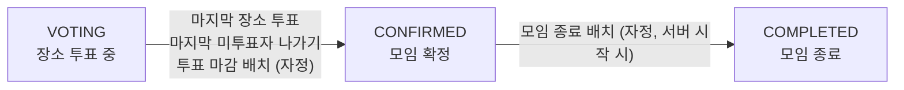

# 장소 투표 ~ 모임 확정 및 종료 로직 수정

> ### 브랜치: fix/#151
> 장소 투표 ~ 모임 확정/종료 과정의 동시성 문제 해결 및 예외 상황 처리 개선

---

## 1. 요약

### 개요
`동시 요청, 모임 나가기, 배치 실패` 상황에서 장소 투표 → 모임 확정 → 모임 종료로 이어지는 상태 전환이 틀어지는 상황 발생



### 문제
| 문제 | 대표 상황                                                                 | 원인                                                 | 해결                                                    |
|---|-----------------------------------------------------------------------|----------------------------------------------------|-------------------------------------------------------|
| **① 동시 요청 충돌** | 마지막 두 명 동시 투표 시 확정 누락, 확정 중 모임 참여/나가기 시 확정 취소, 배치와 겹치면 이중 확정 및 변경 덮어씀 | 잠금 없이 읽은 모임 데이터로 판단 및 저장함(Write Skew, Lost Update) | 모임 단위 비관적 락으로 같은 모임 요청 순차 처리, 배치는 상태 재확인 및 조건부 UPDATE |
| **② 모임 나가기 처리 누락** | 나간 참여자의 표가 확정에 반영됨, 확정 시점 어긋남, 마지막 미투표자가 나가도 자정까지 미확정됨                | 참여자 기준이 쿼리마다 다르고, 확정 판단이 장소 투표 로직에만 있음             | '현재 참여 중인 투표 가능 참여자' 기준 통일 + 모임 나가기 시 모임 확정 가능 여부 재확인 |
| **③ 배치 실패 전파** | 모임 하나 실패 시 전체 롤백, 투표 마감 배치 실패 시 모임 종료 배치 미실행됨                         | 여러 모임을 한 트랜잭션에서 처리함                                | 투표 마감/모임 종료 처리 분리, 모임별 트랜잭션 분리            |

### 수정 후 플로우
```text
 [장소 투표 API]            [모임 나가기 API]          [모임 참여 API]
       │                        │                       │
       ▼                        ▼                       ▼
 findByIdForUpdate        findByIdForUpdate     findByInviteCodeForUpdate   ← Meeting 행 락 (같은 모임 요청은 순서대로)
       │                        │                       │
  투표 저장                 나가기 처리               참여 처리 (투표 중이면 NEW_RESTRICTED)
       │                        │
       └──────────┬─────────────┘
                  ▼
     confirmMeetingIfAllVoted(meeting) (모임 확정 가능 여부 판단)
       - VOTING 상태인가? & 장소 추천 완료되었는가?
       - 투표 가능 참여자 중 미투표자 = 0 ?
                  │ 예
                  ▼
     confirmMeeting(meeting) (모임 확정)
       1) 일정 미정인 경우: 일정 투표 1위 항목으로 일정 확정 (나간 참여자 표 제외)
       2) 장소 투표 1위 항목으로 장소 확정 (나간 참여자 표 제외)
       3) CONFIRMED + 참여자 확정 + 확정 알림

[스케줄러: 매일 자정 실행]
  ① 장소 투표 마감 (전체 트랜잭션 없음)
       └ 마감 대상 모임마다 별도의 트랜잭션으로 처리 (실패한 모임만 롤백)
         : 모임 행 잠금 → VOTING 상태 재확인 → 모임 확정 처리
  ② 모임 종료 (조건부 UPDATE 한 번)
       └ UPDATE meetings SET status=COMPLETED, updated_at=? WHERE status=CONFIRMED AND scheduled_date < 오늘
```

---

## 2. 커밋 내역

### `f379b6a`: 장소 투표 동시성 문제 해결
| 항목 | 내용                                                                                                                                             |
|---|------------------------------------------------------------------------------------------------------------------------------------------------|
| 문제 | - 마지막 두 명이 동시에 투표 → 둘 다 '남은 사람 있음'으로 판단해 확정 누락<br> - 같은 사람 연속 요청 → 투표 중복 저장                                                                    |
| 원인 | 남은 인원 및 기투표 확인과 저장 사이에 잠금 없음                                                                                                                   |
| 해결 | `모임 행 비관적 락(SELECT ... FOR UPDATE)` 으로 같은 모임의 투표 요청은 순차적으로 처리                                                                                  |
| 검토 대안 | - 낙관적 락, SERIALIZABLE: 동시에 투표하면 한쪽 투표를 실패시키는 방식이라, 정상 투표가 에러를 받지 않도록 재시도 로직이 따로 필요함<br/> - 커밋 후 재판정: 투표 저장 후 확정 판단 전에 서버가 중단되면 마감 배치까지 확정이 지연됨 |

### `84c7325`: 투표한 참여자가 나갈 때 모임 확정 시점이 어긋나는 문제 해결
| 항목 | 내용                                                            |
|---|---------------------------------------------------------------|
| 문제 | 투표한 참여자가 나갈 경우 남은 사람이 투표하기 전에 모임 확정됨, 전원 투표해도 모임 확정 안됨        |
| 원인 | `투표한 사람 수(나간 사람 포함) == 투표 가능 인원(나간 사람 제외)`으로 판단 (서로 다른 집합 비교) |
| 해결 | `투표 가능 참여자 중 투표 기록 없는 사람 = 0`으로 판단 (한 집합만 세는 `NOT EXISTS` 쿼리) |

### `2f02d9f`: 모임 확정 중 모임 참여/나가기 시 확정 취소 문제 해결
| 항목 | 내용                                                                                                                                                       |
|---|----------------------------------------------------------------------------------------------------------------------------------------------------------|
| 문제 | 마지막 투표로 확정되는 순간 모임 참여/나가기 → 확정된 모임이 VOTING 상태로 되돌아감                                                                                                      |
| 원인 | 잠금 없이 읽은 이전 모임 데이터를 저장 → JPA 변경 감지가 모든 컬럼을 옛 값으로 덮어씀 (Lost Update)                                                                                       |
| 해결 | 모임 참여/나가기에도 `같은 모임 행 비관적 락` 조회 적용 (조회 방식만 교체)                                                                                                              |
| 검토 대안 | - @DynamicUpdate: 바뀐 컬럼만 저장하지만, 두 요청이 같은 컬럼(상태)을 고치는 경합은 못 막음<br/> - 원자적 UPDATE 쿼리: 모임장 승계 등 관련 로직 추가 변경 필요<br/> - 낙관적 락: 충돌한 참여/나가기 요청이 실패해 재시도 처리가 필요함 |

### `cef14e2`: 일정 미정 모임의 일정 확정 시점 변경 (일정 투표 현황 조회 API → 모임 확정)
| 항목 | 내용                                                                            |
|---|-------------------------------------------------------------------------------|
| 문제 | - 일정 투표 현황 조회(GET) 시 일정 확정 → 아무도 조회하지 않으면 일정 없이 확정됨<br> - 조회 API에서 쓰기 작업이 발생함 |
| 원인 | 조회 API가 상태 변경(일정 확정)을 진행함                                                     |
| 해결 | 모임 확정 시점에 일정과 장소를 한 번에 확정 (일정 투표 현황 조회 API는 일정 투표 내역 집계만 담당)                  |

### `0c367d7`: 장소 투표 집계에서 나간 참여자 표 제외
| 항목 | 내용                                                                                                               |
|---|------------------------------------------------------------------------------------------------------------------|
| 문제 | 장소 투표 현황(투표 인원, 득표수)과 확정 장소에 나간 참여자의 표가 반영됨                                                                      |
| 원인 | 집계 쿼리가 참여자가 나갔는지 보지 않음                                                                                           |
| 해결 | 집계 쿼리에서 참여자 테이블과 조인해 현재 참여 중인 사람의 표만 집계                                                    |

### `c85dfb5`: 마지막 미투표자가 나가면 즉시 모임 확정 처리
| 항목 | 내용                                                                                                                                                     |
|---|--------------------------------------------------------------------------------------------------------------------------------------------------------|
| 문제 | 마지막 미투표자가 나가 남은 전원이 투표 완료 상태가 돼도 자정 마감 배치까지 모임 확정 안됨                                                                                                   |
| 원인 | 확정 판단이 장소 투표 로직에만 존재함                                                                                                                                  |
| 해결 | - 모임 확정 처리를 한 곳으로 모으고 모임 나가기 직후 같은 트랜잭션, 같은 잠금 안에서 판단<br> - 판단 조건을 '장소 추천이 끝난 VOTING'으로 통일 (투표, 모임 나가기, 배치 공통)                                         |
| 검토 대안 | - 나가기 커밋 후 이벤트로 판단: 트랜잭션이 둘로 나뉘어 구조가 복잡해짐<br/> - 마감 배치가 처리: 최대 하루 확정 지연이 그대로 남음 |

### `91e1297`: 장소 투표 마감 배치 실패 격리 및 이중 확정 방지
| 항목 | 내용                                                                 |
|---|--------------------------------------------------------------------|
| 문제 | - 모임 하나 실패 시 전체가 롤백됨<br> - 배치와 사용자의 마지막 투표가 겹치면 이중 확정 및 덮어쓰기 문제 발생 |
| 원인 | 모든 모임을 한 트랜잭션에서 잠금 없이 처리함                                          |
| 해결 | `모임별 트랜잭션 분리(REQUIRES_NEW)` + 처리 직전 모임 행 잠금 후 VOTING 상태인지 재확인      |

### `3a8e672`: 모임 종료 배치 실패 격리 및 덮어쓰기 문제 해결
| 항목 | 내용                                                                                                                                                                                                                           |
|---|------------------------------------------------------------------------------------------------------------------------------------------------------------------------------------------------------------------------------|
| 문제 | - 모임 종료 중 모임을 나갈 경우 인원, 모임장 변경이 덮어써짐<br> - 투표 마감 배치 실패 시 모임 종료 배치 미실행                                                                                                                                                        |
| 원인 | - 엔티티를 읽어 상태 변경 후 통째로 저장<br> - 장소 투표 마감/모임 종료 처리를 한 try에서 실행함                                                                                                                                                                |
| 해결 | - 모임 종료: 조건부 UPDATE 한 번 (`status=CONFIRMED AND scheduled_date<오늘` 인 행의 상태만 변경 → 덮어쓰기 없음, 여러 번 실행해도 결과 동일), 실패 시 재시도(총 3번)<br> - 스케줄러 단계 분리: 투표 마감/모임 종료를 각각 따로 예외 처리<br> - 서버 시작 시 모임 종료 배치 실행 (자정에 서버가 꺼져 있었어도 밀린 모임 종료 처리) |
| 검토 대안 | - 대상 모임을 잠금으로 한 번에 조회: 여러 모임을 동시에 잠가 다른 요청과 잠금 순서가 엇갈리면 데드락 발생 가능<br/> - 모임별 트랜잭션: 상태 값 하나만 바꾸는 작업에 비해 무거움                                                                                                                   |
